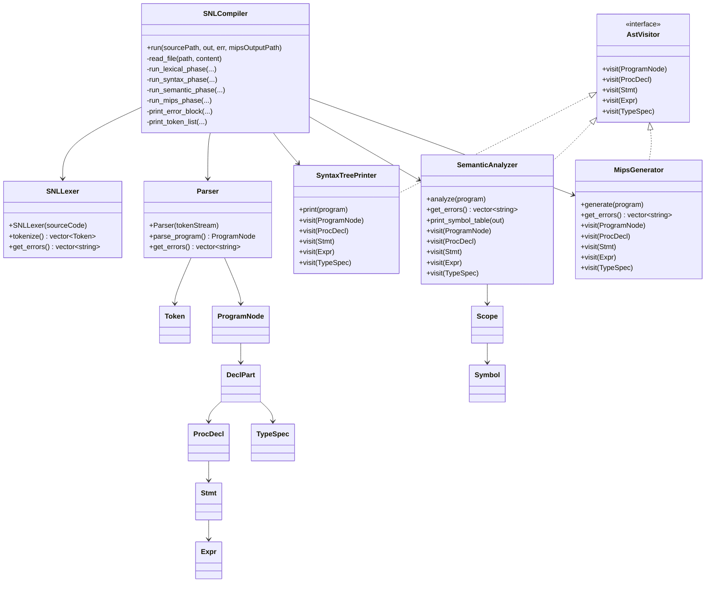
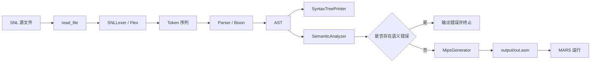

# JLU SNL Compiler

吉林大学 2023 级《编译原理》课程设计项目。

这是一个面向 **SNL（Simple Nested Language）** 的教学型编译器，实现了从源程序到 **词法分析、语法分析、抽象语法树构建、语义检查、MIPS 汇编生成** 的完整流程，并支持通过 **MARS** 直接运行生成结果。

仓库地址：

```text
git@github.com:Wubian111/JLU_snl_compiler.git
```

## 项目简介

这个项目的重点在于完整实现一条适合编译原理课程展示的编译流水线：

1. 读取 SNL 源文件
2. 使用 Flex 进行词法分析
3. 使用 Bison 进行语法分析
4. 构建抽象语法树 AST
5. 建立符号表并执行语义检查
6. 生成可在 MARS 中运行的 32 位 MIPS 汇编

## 项目特性

- 完整前端：词法分析、语法分析、AST 构建
- 完整静态语义检查：作用域、符号表、类型匹配、参数检查
- 后端可运行：生成 MARS 兼容的 32 位 MIPS 汇编
- 错误分阶段输出：词法错误、语法错误、语义错误互相独立
- 样例齐全：包含正确程序与多类错误程序
- 工程结构清晰：规则文件、生成文件、核心模块职责明确

## 已支持的 SNL 特性

- 基本类型：`integer`、`char`
- 类型别名：`type myint = integer;`
- 数组类型：`array [1..10] of integer`
- 记录类型：`record ... end`
- 变量声明、类型声明、过程声明
- 值参和 `var` 引用参数
- 赋值语句
- 条件语句：`if ... then ... else ... fi`
- 循环语句：`while ... do ... endwh`
- 输入输出语句：`read(...)`、`write(...)`
- 过程调用
- `return(...)`
- 数组下标访问
- 记录字段访问
- 加减乘除与关系运算

## 项目结构

```text
JLU_snl_compiler/
├─ grammar/                 Flex / Bison 规则文件
│  ├─ snl_lexer.l
│  └─ snl_parser.y
├─ include/                 头文件
├─ src/                     C++ 源码与生成后的前端代码
├─ examples/                基础示例程序
├─ tests/                   正确样例与错误样例
├─ tools/                   本地工具
│  ├─ win_flex_bison/       Windows 版 Flex / Bison
│  └─ Mars for Compile 2022.jar
├─ build/                   编译产物目录
├─ report/                  课程报告与相关文档
├─ output/                  汇编输出、日志、运行结果
├─ Makefile                 构建、测试与清理脚本
└─ README.md
```

说明：

- `src/` 与 `include/` 中已经保留了生成后的前端代码，因此即使不重新执行 `make generate`，通常也可以直接构建。
- `tools/` 中附带了 Windows 环境使用的 `win_flex_bison` 和 `MARS`，便于课程设计环境快速复现。
- `build/`、`output/` 属于运行产物目录，不建议作为源码内容提交。

## 总体架构

项目采用典型的“前端 + 语义 + 后端”分层结构：

- `SNLLexer`：负责把源代码转成 Token 序列
- `Parser`：负责把 Token 序列规约为 AST
- `SyntaxTreePrinter`：负责把 AST 打印成可读树形结构
- `SemanticAnalyzer`：负责符号表建立、作用域管理和语义检查
- `MipsGenerator`：负责将语义正确的 AST 翻译为 MIPS 汇编
- `SNLCompiler`：作为外观类，统一调度整个编译流程

## 类图



类图说明：

- `SNLCompiler` 是总调度器，对外只暴露一次 `run(...)` 即可完成整条编译流程。
- `Parser` 的输入是 Token 流，输出是 `ProgramNode` 为根的 AST。
- `SyntaxTreePrinter`、`SemanticAnalyzer`、`MipsGenerator` 都基于 `AstVisitor` 访问同一棵 AST。
- `SemanticAnalyzer` 通过 `Scope` 和 `Symbol` 组织多层作用域与符号表。

## 编译流程图



## 核心模块说明

### 1. 词法分析器 `SNLLexer`

封装 Flex 生成的扫描器，负责：

- 扫描源代码
- 识别关键字、标识符、常量、界符、运算符
- 收集词法错误
- 输出 `std::vector<Token>`

相关文件：

- `grammar/snl_lexer.l`
- `include/snl_lexer.h`
- `include/snl_generated_lexer.h`
- `src/snl_lexer_impl.cpp`
- `src/snl_lexer_generated.cpp`

### 2. 语法分析器 `Parser`

封装 Bison 生成的 LALR 语法分析器，负责：

- 读取 Token 序列
- 按 SNL 文法进行规约
- 在规约过程中构建 AST
- 在错误位置抛出语法错误信息

相关文件：

- `grammar/snl_parser.y`
- `include/snl_parser.h`
- `include/snl_parser_driver.h`
- `include/snl_parser_generated.h`
- `src/snl_parser.cpp`
- `src/snl_parser_generated.cpp`

### 3. 语法树打印器 `SyntaxTreePrinter`

作为 AST Visitor 的一个实现，用树形文本输出语法树，便于：

- 检查文法规约结果
- 验证表达式结构
- 展示课程设计中的分析结果

相关文件：

- `include/snl_syntax_tree_printer.h`
- `src/snl_syntax_tree_printer.cpp`

### 4. 语义分析器 `SemanticAnalyzer`

负责静态语义检查，主要工作包括：

- 建立符号表
- 管理嵌套作用域
- 检查标识符声明与引用
- 检查类型一致性
- 检查过程参数个数与参数类型
- 检查数组和记录访问的合法性

相关文件：

- `include/snl_semantic.h`
- `src/snl_semantic.cpp`

### 5. 目标代码生成器 `MipsGenerator`

负责将语义正确的 AST 翻译为 MIPS 汇编，主要包括：

- 全局变量内存布局
- 过程标签与栈帧组织
- 局部变量和参数访问
- 值参与引用参数的区分
- 表达式求值
- `if` / `while` / `read` / `write` / `return`
- 数组和记录地址计算

相关文件：

- `include/snl_mips_generator.h`
- `src/snl_mips_generator.cpp`

### 6. 编译流程外观类 `SNLCompiler`

`SNLCompiler` 是项目的统一入口，按顺序执行：

1. 读取源文件
2. 词法分析
3. 语法分析
4. 语法树输出
5. 语义分析
6. 可选的 MIPS 生成

相关文件：

- `include/snl_compiler.h`
- `src/snl_compiler.cpp`
- `src/main.cpp`

## 环境要求

本项目当前以 **Windows 环境** 为主要运行目标，原因是：

- `Makefile` 直接使用 `powershell.exe`
- 仓库自带 Windows 版 `win_flex_bison`
- MIPS 测试流程直接对接本地 `java + MARS`

当前已验证环境：

- `g++ 15.2.0`
- `GNU Make 4.4.1`
- `Java 24.0.2`
- Windows PowerShell

如果需要迁移到 Linux / macOS，需要自行调整：

- `Makefile` 的 shell 配置
- Flex / Bison 路径
- Windows 风格路径分隔符

## 克隆与构建

### 1. 克隆仓库

```bash
git clone git@github.com:Wubian111/JLU_snl_compiler.git
cd JLU_snl_compiler
```

### 2. 构建项目

```powershell
make build
```

构建成功后，生成：

```text
build/snl_compiler.exe
```

## 快速开始

### 1. 运行前端分析

```powershell
make test FILE=examples/test.snl
```

这会输出：

- Token 列表
- 语法树
- 符号表
- 语义分析结果

### 2. 生成并运行 MIPS

```powershell
make test-mips FILE=tests\mips_record_ok.snl
```

这会：

1. 生成 `output/out.asm`
2. 使用 `tests/test_input.txt` 作为标准输入调用 MARS
3. 把运行结果写入 `output/out.txt`

当前仓库中，这个样例的运行结果为：

```text
12
```

## 使用方法

### 方式一：使用 Makefile

#### `make generate`

重新根据规则文件生成前端代码：

```powershell
make generate
```

适用场景：

- 修改了 `grammar/snl_lexer.l`
- 修改了 `grammar/snl_parser.y`
- 需要重新生成 Flex / Bison 输出文件

生成文件包括：

- `src/snl_lexer_generated.cpp`
- `src/snl_parser_generated.cpp`
- `include/snl_parser_generated.h`

#### `make build`

编译整个项目：

```powershell
make build
```

#### `make test FILE=...`

运行编译器前端分析流程：

```powershell
make test FILE=examples/test.snl
make test FILE=tests\syntax_missing_then.snl
make test FILE=tests\semantic_undeclared.snl
```

说明：

- `FILE` 用于指定待测试的 SNL 文件
- 若某一阶段出错，后续阶段不会继续执行
- 程序退出码 `0` 表示成功，`1` 表示失败

#### `make test-mips FILE=...`

生成 MIPS 并调用 MARS 运行：

```powershell
make test-mips FILE=tests\mips_record_ok.snl
```

默认使用：

- MIPS 输出：`output/out.asm`
- 编译日志：`output/compiler.log`
- MARS 输入：`tests/test_input.txt`
- 运行结果：`output/out.txt`

也可以自定义输出路径：

```powershell
make test-mips FILE=tests\mips_record_ok.snl MIPS_OUT=output\record.asm MIPS_RESULT=output\record.txt
```

#### `make clean`

清理构建产物：

```powershell
make clean
```

#### `make help`

查看帮助：

```powershell
make help
```

### 方式二：直接运行可执行文件

```powershell
build\snl_compiler.exe <source.snl>
build\snl_compiler.exe <source.snl> --mips <output.asm>
```

示例：

```powershell
build\snl_compiler.exe examples\test.snl
build\snl_compiler.exe tests\mips_record_ok.snl --mips output\record.asm
```

区别：

- 不带 `--mips`：只做前端分析
- 带 `--mips`：前端通过后继续生成 MIPS

## 输出说明

### 1. 词法分析结果

输出每个 Token 的：

- 行号
- 词法类别
- 语义值

可用于检查：

- 保留字识别是否正确
- 标识符和常量识别是否正确
- 非法字符是否被正确拦截

### 2. 语法树

采用树形文本结构输出，可用于检查：

- 程序结构是否按文法构造
- 表达式优先级和结合性是否正确
- 控制语句是否被正确规约

### 3. 符号表

语义分析阶段会打印：

- 作用域名称
- 嵌套层次
- 标识符名称
- 标识符类别
- 类型信息
- 声明行号

### 4. 错误信息

项目按阶段报错，便于定位问题：

- 词法错误：非法字符、未闭合注释、非法字符常量
- 语法错误：缺少 `then`、括号不匹配、语句结构错误
- 语义错误：变量未声明、参数不匹配、字段访问非法

例如：

```powershell
make test FILE=tests\syntax_missing_then.snl
```

会得到类似输出：

```text
===== 语法错误 =====
第 6 行：语法错误，当前 Token 为 WRITE('write')
```

再例如：

```powershell
make test FILE=tests\semantic_undeclared.snl
```

会得到类似输出：

```text
===== 语义错误 =====
第 5 行：标识符未声明 'y'
```

## 示例程序

### 1. 基础示例 `examples/test.snl`

功能：

- 声明类型别名
- 声明整数变量
- 读取两个整数
- 使用 `if` 比较大小
- 输出结果

### 2. MIPS 示例 `tests/mips_record_ok.snl`

功能：

- 使用 `record`
- 在记录中包含数组字段
- 进行字段赋值和数组访问
- 生成 MIPS 并在 MARS 中运行

核心代码：

```snl
program p
type
  pair = record
    integer first;
    array [1..2] of integer nums;
    integer last;
  end;
var
  pair r;
  integer x;
begin
  read(x);
  r.first := x;
  r.nums[1] := r.first + 2;
  r.last := r.nums[1] * 3;
  write(r.last)
end.
```

当 `tests/test_input.txt` 输入 `2` 时，输出：

```text
12
```

## 测试样例

`tests/` 中提供了多类样例，适合展示项目完成度：

- `tests/lex_bad_char.snl`：词法错误示例
- `tests/syntax_missing_then.snl`：语法错误示例
- `tests/semantic_undeclared.snl`：未声明标识符示例
- `tests/semantic_array_bounds.snl`：数组相关语义检查示例
- `tests/procedure_ok.snl`：过程与参数传递示例
- `tests/mips_record_ok.snl`：记录、数组与 MIPS 生成示例

## 构建系统说明

`Makefile` 已封装常用流程：

- `generate`：重新生成 Flex / Bison 文件
- `build`：编译项目
- `test`：运行前端分析
- `test-mips`：生成 MIPS 并调用 MARS
- `clean`：清理构建产物
- `help`：显示帮助
- `info`：显示实现概览

当前构建参数特点：

- 使用 `C++17`
- 同时包含 `include/` 与 `src/` 头文件路径
- 默认输出 `build/snl_compiler.exe`
- 使用 PowerShell 作为 Make shell
- 控制台输出按 UTF-8 配置，便于中文显示

## 项目亮点

- **实现链路完整**：从源码到目标汇编全链路打通
- **教学导向清晰**：规则文件、AST、符号表、后端代码都可直接学习
- **样例覆盖充分**：正确用例和错误用例都有
- **后端不是摆设**：生成的 MIPS 可以在 MARS 中直接运行
- **结构适合答辩**：模块职责清晰，说明成本低

## 当前限制

- 构建脚本主要面向 Windows
- 目标平台为教学用途的 MARS/MIPS，而不是通用后端
- 语义分析和错误恢复偏向课程展示，不追求工业级容错
- 暂未实现中间代码优化、寄存器分配优化等高级优化模块

## 关键入口文件

- `src/main.cpp`：程序入口
- `src/snl_compiler.cpp`：编译流程调度
- `grammar/snl_lexer.l`：词法规则定义
- `grammar/snl_parser.y`：语法规则定义
- `src/snl_semantic.cpp`：语义分析实现
- `src/snl_mips_generator.cpp`：MIPS 后端实现

## 总结

这是一个面向 SNL 教学语言的完整课程设计编译器，覆盖了词法分析、语法分析、AST 构建、语义检查与 MIPS 代码生成，适合作为吉林大学《编译原理》课程设计成果开源展示。
